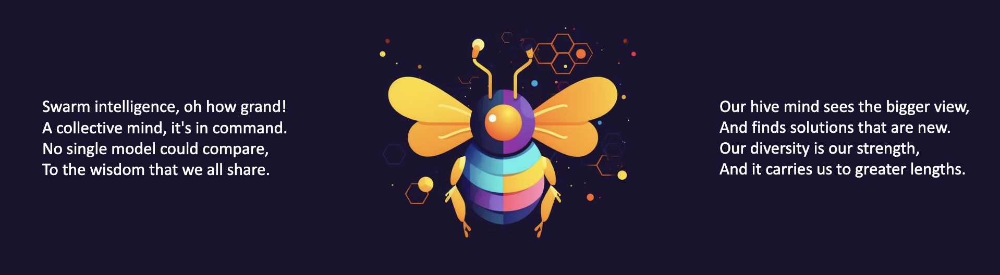
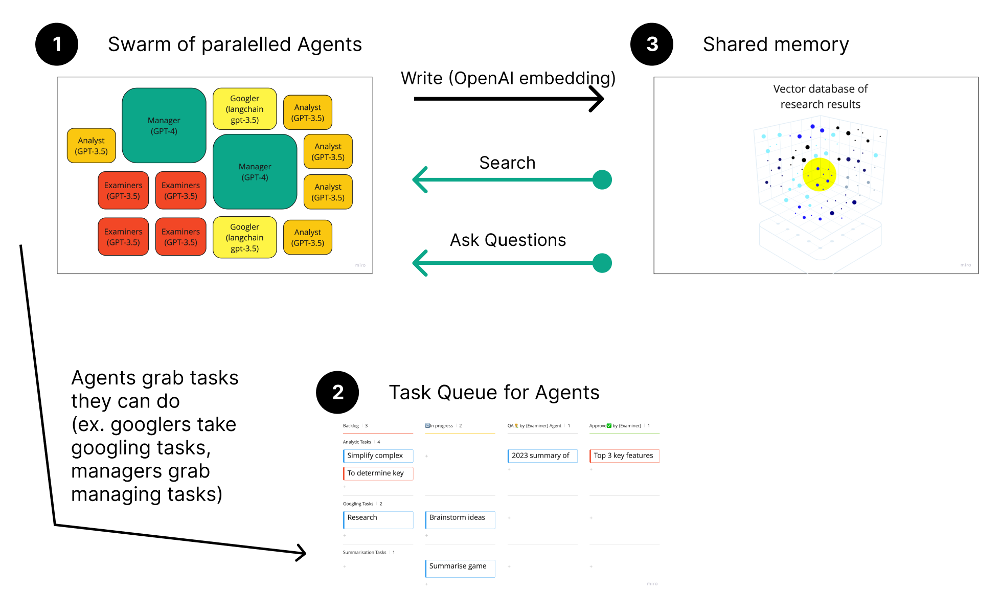

# GPT-Swarm

[](https://opensource.org/licenses/Apache-2.0)
[](https://www.python.org/downloads/)
[](https://discord.gg/seKVhCtcAJ)

<p align="center">
  
</p>

[Videos submission for the lablab hackathon](https://lablab.ai/event/autonomous-gpt-agents-hackathon/autoswarm/gpt-swarm)\
[Simple frontend demo](https://huggingface.co/spaces/alex-mindspace/gpt-agents)

GPT-Swarm is a groundbreaking project that combines swarm intelligence and advanced language models to tackle complex tasks across diverse domains. Our innovative framework is robust, adaptive, and scalable, outperforming single models by leveraging the power of collective problem-solving and distributed decision-making. Not to mention the lightning-fast speed with which it performs the research.


## Table of Contents

- [Why](#why)
- [Architecture Overview](#architecture-overview)
- [Installation and Usage](#installation-and-usage)
- [How to Contribute](#how-to-contribute)

# Why
## What Swarm Intelligence Is
GPT-Swarm is inspired by the principles of emergence. In nature, when you allow simple agents to interract with each other, they show fundamentally new capabilities. Typical examples are bees or ant hives, or even countries and cultures.

## Unprecedented Scalability and Diversity
You can add any models with any capabilities to the swarm and make them work together with each other.

## Adaptive Intelligence without Retraining
By utilizing shared vector-based memory, and giving the swarm the ability to adjust itself and it's behavior, we achieve similar adaptability as in reinforcement learning, but without expensive retraining of base-models.

## What it can do
Swarm is the only intelligence system to date that can effectively do complex tasks like performing market research or generating whole software solutions.


## References:
- [Bees algorithm Wiki](https://en.wikipedia.org/wiki/Bees_algorithm)
- [Multi agent intelligence Wiki](https://en.wikipedia.org/wiki/Multi-agent_system)
- [Swarm intelligence Wiki](https://en.wikipedia.org/wiki/Swarm_intelligence)
- [Swarm Intelligence: From Natural to Artificial Systems, by Eric Bonabeau](https://www.amazon.de/Swarm-Intelligence-Artificial-Institute-Complexity/dp/0195131592/ref=sr_1_1?__mk_de_DE=%C3%85M%C3%85%C5%BD%C3%95%C3%91&crid=2IE2ONY3K49RV&keywords=swarm+intelligence+from+natural+to+artificial+systems&qid=1681176913&sprefix=swarm+intelligence+from+natural+to+artificial+systems%2Caps%2C73&sr=8-1)

# Architecture overview
<p align="center">
  
</p>

# Installation and Usage

1. First, you need to create a `keys.json` file in the root folder. `GOOGLE_API_KEY` and `CUSTOM_SEARCH_ENGINE_ID` are needed for the models to be able to use google search.
    ```json
    {
        "OPENAI_API_KEY": "sk-YoUrKey",
        "GOOGLE_API_KEY": "blablablaapiKey", 
        "CUSTOM_SEARCH_ENGINE_ID": "12345678aa25"
    }
    ```

2. Then you can specify the swarm configuration and tasks in \
    `swarm_config.yaml`

3. After that, to run the swarm simply run
    ```bash
    # On Linux or Mac:
    ./run.sh start
    # On Windows:
    .\run.bat
    ```

4. After some time the swarm will start producing a report and storing it in the run folder. By default it's in:\
    `./tmp/swarm/output.txt` and `./tmp/swarm/output.json`

## Advanced usage
5. If you are brave, you can go though the logs. Be careful, because the swarm produces incredible amount of data very fast. You can find logs in `./tmp/swarm/swarm.json`. You can also use `./tests/_explore_logs.ipynb` to more easily digest the logs.

6. The shared memory in the run is persistent. You can ask additional questions to this memory using `./tests/_task_to_vdb.ipynb`

# Next-ups

- Make adding new models as easy as possible, including custom deployed ones like llama
- Multi-key support for higher scalability

# 🚧 Docker
Build Multi-Arch image:

```shell
docker buildx build --platform linux/amd64,linux/arm64 --tag gpt-swarm/gpt-swarm:0.0.0 .
```

# How to Contribute
- Follow the SOLID principles and don't break the abstractions
- Create bite-sized PRs
