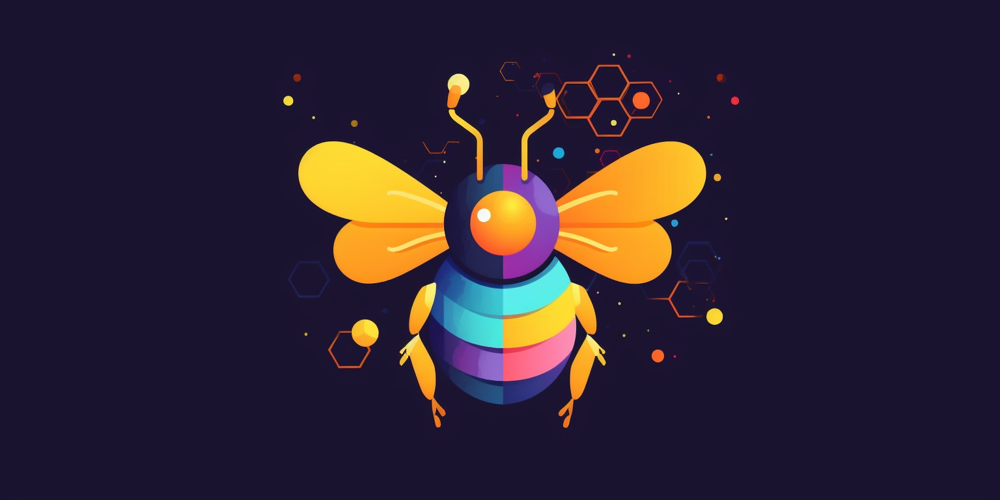
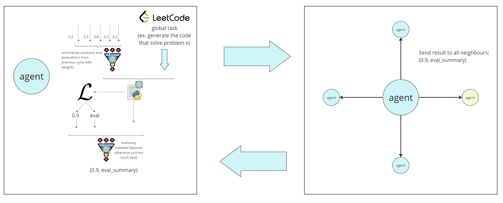

# GPT-Swarm

[](https://opensource.org/licenses/Apache-2.0)
[](https://www.python.org/downloads/)

<p align="center">
  
</p>

GPT-Swarm is a groundbreaking project that combines swarm intelligence and advanced language models to tackle complex tasks across diverse domains. Our innovative framework is robust, adaptive, and scalable, outperforming single models by leveraging the power of collective problem-solving and distributed decision-making.


## Table of Contents

- [Principles](#principles)
- [Why](#why)
- [Architecture Overview](#architecture-overview)
- [Installation and Usage](#installation-an-usage)
- [Documentation](#documentation)
- [How to Contribute](#how-to-contribute)

# Principles
## What Swarm Intelligence Is
GPT-Swarm, inspired by the bee search algorithm, employs swarm intelligence to solve optimization problems. Key principles include stigmergy and emergence.

Stigmergy allows agents to communicate indirectly by modifying their environment, sharing information through a shared memory. This resembles the bee's waggle dance for food source communication.

Emergence is the phenomenon where complex behavior arises from simple local interactions. Our algorithm encourages emergent behavior, enabling the swarm to converge to optimal or near-optimal solutions by working collectively.

## References:
- [Bees algorithm Wiki](https://en.wikipedia.org/wiki/Bees_algorithm)
- [Multi agent intelligence Wiki](https://en.wikipedia.org/wiki/Multi-agent_system)
- [Swarm intelligence Wiki](https://en.wikipedia.org/wiki/Swarm_intelligence)
- [Swarm Intelligence: From Natural to Artificial Systems, by Eric Bonabeau](https://www.amazon.de/Swarm-Intelligence-Artificial-Institute-Complexity/dp/0195131592/ref=sr_1_1?__mk_de_DE=%C3%85M%C3%85%C5%BD%C3%95%C3%91&crid=2IE2ONY3K49RV&keywords=swarm+intelligence+from+natural+to+artificial+systems&qid=1681176913&sprefix=swarm+intelligence+from+natural+to+artificial+systems%2Caps%2C73&sr=8-1)

# Why

## Scalable and Adaptive Intelligence without Retraining
aaa

## What it can do
aaa

# Architecture overview
<p align="center">
  
</p>

Because  the exchange generates a lot of text, there are two 'distillation' steps. First one is to summarise the solutions coming from the neighbors (there I now also take only 4 best solutions. Agents' locations and connections are customisable). In the second summarisation, the agen needs to summarise it's solution and also critically analize it based on the evaluation. Heavy prompt engineering needed for these steps. 

## Features

- Abstractions for agents => you can theoretically use any agents you want in your swarm as long as they implement the interactions between each other and the swarm (for example add agents to the swarm that can google using langchain)
- Abstractions for the challenges => can ask the swarm so solve any problem as long as you have a cost function.
Current challenge is looking for the solutions of the leetcode problems
- Mulithreading for faster computation (still a deadlock somewhere in the python challenge 2)

# Installation and Usage

To use openAI's api, you need to create a keys.json file in the root foler:
```json
{
    "OPENAI_API_KEY": "sk-YoUrKey",
}
```

Then as usual `pip install -r requirements.txt` and you are ready to go.

## Examples

# Documentation
tbd

# How to Contribute

- follow the SOLID principles and don't break the abstractions
- create bite-sized PRs